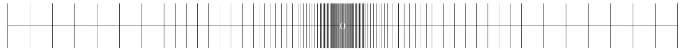

## Course Overview

CS367 is an Introduction to a field of CS called Systems Programming
Systems Programming – Programming services to other software.

+ Game Engines
+ Operating Systems
+ Embedded Systems
+ Industrial Automation
+ Networking
+ Optimizing and Reverse Engineering Code

This course will prepare you for CS471 (Operating Systems), as well as a large number of other such courses.

## Course Goals

Goals of prior courses:

+ CS 112 and CS 211
  + High level programming
  + Creating applications for users
  + Object oriented paradigm
+ CS 262
  + Lower level programming
  + Directly accessing memory and hardware
  + Used for embedded systems
+ CS 367
  + Remove all the high-level abstractions to understand what happens "under the hood" in programming

### Removing Abstractions

Most CS courses focus on adding abstractions

+ Abstract data types (like Interfaces in Java)
+ Asymptotic Analysis (Big-$O$)

Abstractions only go so far

+ In systems, it's important to understand the underlying implementation
  + This is doubly true in the presence of bugs!

### Outcomes

After taking this course you should

+ Become more effective programmers
  + Gain more knowledge about how to find and eliminate bugs *efficiently* (that means no more `printf` statements everywhere)
+ Prepare for later systems programming courses in CS
  + CS 440 - Compilers
  + CS 455 - Networking
  + CS 465 - Architecture
  + CS 468 - Secure Programming
  + CS 469 - Security Engineering
  + CS 471 - Operating Systems
  + CS 475 - Concurrent and Distributed Systems

## Great Realities in Programming

### Observation 1: Same-signed products

We know from our previous math courses that $(\forall x \in \mathbb{Z})(x^2 \geq 0)$.

Floating point numbers have this property as part of their definition, so it is true for them by construction.

But what about C's integral data types? Nope (see `int_of.c`)!

C's integer data types can very easily suffer from overflows and underflows.

### Observation 2: Associative property of addition

We know from our previous math courses that $(\forall x,y,z \in \mathbb{Z})((x+y)+z = x+(y+z))$.

C's integral data types also have this property. The addition may overflow or underflow, but it is associative.

Floating point numbers do not have this property (see `fp_of.c`). This is due to the way that floating point numbers were defined -- they are meant to represent a great *range* of numbers, but not necessarily with great *accuracy*. That is to say that there are gaps between each numbers.

{ width=75% }

*Fun math fact*: Those gaps above can never be closed. Because the real numbers aren't denumerable, they can never be encoded in a single data type. The rationals are denumerable, but they aren't an order complete field, so they have gaps (the reals are the closure of the rationals, so they are order complete and do not have gaps).

*Computer arithmetic*: There are a finite number of bits available to represent a number. The way that we encode the number in those bits changes its properties under different operations.

Integers have:

+ Commutativity
+ Associativity
+ Distributivity

Floating point numbers have:

+ Monotonicity (of course they have a total ordering, they're denumerable)
+ Values of signs

*Omitted*: The following code snippets are omitted:

+ `int_index.c`
+ `fp_index_a.c`
+ `fp_index_b.c`

### Observation 3: Knowing assembly is helpful

Chances are you'll never need to write a program in assembly. However, you'll almost certainly have to look at it at some point to figure out why something isn't working as it's supposed to (see `compiler_a.c` and `compiler_b.c`). You'll have to do this with some frequency if you're doing any of the following:

+ Tuning program performance
  + Understanding what optimizations are done or not done by the compiler
  + Sussing out inefficiencies
+ Implementing system software
  + Compiles target machine code and will change your code in odd ways
+ Creating or fighting malware
  + The x86 ISA is a critical language for reverse engineering

### Observation 4: Memory matters

+ Memory isn't unbounded
  + It must be allocated and managed by each process
  + Many applications are memory dominated
+ Memory reference bugs are extremely problematic
+ Memory performance is not uniform
  + Exploiting data locality greatly affects program performance
  + Adjusting the data types and code to fit into a cache can also lead to better performance

## Memory Reference Bug

