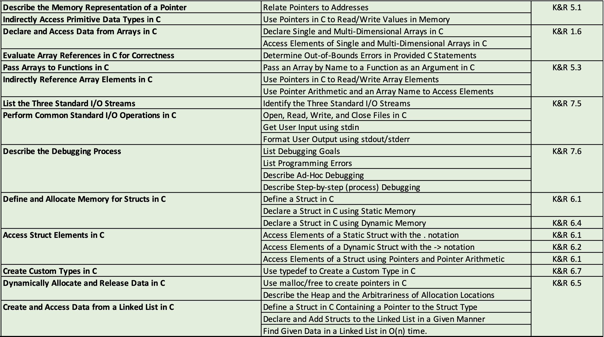
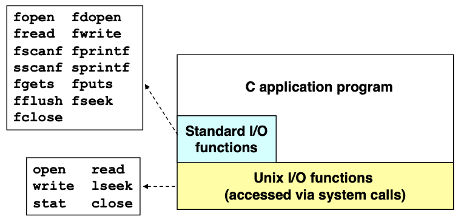
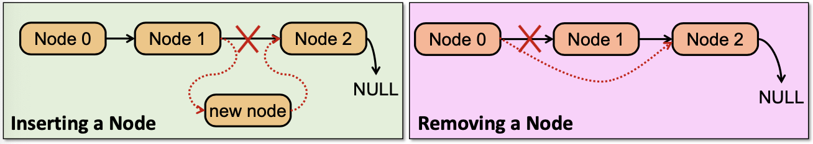

## Reading Track

Reading homework:

1. Read through Chapter 2.1 (bits and information storage) of the textbook
   + The next lecture begins with bitwise, logical, and shift operations in C
2. Continue to review C. If you know these well in C, it will be a lot easier over the next two months.
   + Passing by reference and working with pointers in functions
   + Dereferencing values: `*ptr = 42;`
   + Pointer arithmetic with arrays: `*(ary + 3) = 42;`
   + Working with `struct`s and dynamic memory
   + Working with linked lists using dynamically allocated `struct`s

## Lecture Overview from CS262

{ width=100% }

## Programming Tools in UNIX

+ Integrated Development Environments (IDE)
  + Visual Studio, Netbeans, Eclipse, jGRASP
  + These don't work (or work well) over a remote terminal
    + In Systems Programming, it's common to remotely connect to an embedded device and work directly on it
    + This semester, we'll be working on the Zeus server remotely
+ You don't need an IDE. All you need are
  + A text editor (`vi`/`vim` or `emacs`)
  + A compiler (`gcc`)
  + A debugger (`gdb`)

## Compiling on Zeus

The general template we'll be using is

```bash
gcc -g -01 -o executable source_file.c
```

The flags used in this example are

+ `-g` Compile with symbols in the code. Useful for debugging.
+ `-O1` Compile with optimization level one. This reduces the code/memory footprint.
+ `-o` Specify the output filename. If you don't specify the output, you'll get `a.out`.

## Makefiles

Makefiles are super useful for building multi-source file programs.

There are three parts to each *rule* in a Makefile. Let's diagram walk through the following rule.

```Makefile
prog: prog.c lib.c
    gcc –g –o prog prog.c lib.c
```

Component | Example |
:-------: | :-----: |
Rule name | `prog` |
Dependencies | `prog.c lib.c` |
Action | `gcc -g -o prog prog.c lib.c` |

The Makefile ensures that the dependencies have been satisfied before running the action. If you were to put another rule as a dependency, it would verify that *that* dependency was satisfied before continuing.

Note that the tab before the action is important!

## Pointers

At the machine level, you get two types of data: *values* and *addresses*.

C pointers let us work with addresses.

Before we continue, let's look at the size of different data types on Zeus.

Data Type | Size |
:-------: | :--: |
`char` | 1 B |
`short` | 2 B |
`int` | 4 B |
`long` | 8 B |
`char *` | 8 B |
`short *` | 8 B |
`int *` | 8 B |
`long *` | 8 B |

### Example 1

Consider the following example:

```c
int main() {
  int a = 42;
  int *p;
}
```

1. How do we set `p` to point to `a`?
   + Let `p` reference the memory address of `a`: `p = &a;`
2. How do we set `a` to 12 using `p`?
   + Dereference `p` to change it's value: `*p = 12;`

### Question 1

*File*: `ptr_2.c`

What will the output of the following program be?

```c
#include <stdio.h>

int main() {
  int a = 42, b = 16;
  int *p, *q;
  p = &a;
  q = &b;
  *q = *p;
  p = q;
  printf("%d %d %d %d\n", a, b, *p, *q);
}
```

The output is:

```bash
$ ./ptr_2
42 42 42 42
```

The pointee of `q` is set equal to the pointee of `p` with the statement `*q = *p;`. The statement `p = q;` changes `p` so that it points at the same thing that `q` does -- a value which was set equal the thing that `p` *was* pointing at earlier.

### Question 2

Write a function called swap to exchange two integers by reference.

```c
void swap(int *a, int *b) {
  int temp = *a;
  *a = *b;
  *b = temp;
}
```

## Arrays

An array is a list of values arranged consecutively in memory.

Arrays in C use the `[]` bracket notation which is indexed by offsets. In fact, `a[n]` is really just syntactic sugar for `*(a + n)`. Remember that pointers are a different type: when you add an integer to a pointer, it's scaled by something akin to the `sizeof` function.

Some examples:

+ `int a[5];` declares an array of five `int`s (on Zeus this is 20 bytes)
+ `a[0]` references the value at address `a`
+ `a[1]` references the value at the address `(a+1)`.
  + As noted above, in hardware this would be the address of `a` plus four bytes (since an `int` on Zeus is four bytes)
+ `a[4]` references the last element of `a`
+ `a[5]` is out of bounds but completely legal C -- no bounds checking, remember?

## Arrays and Pointers

*Files*: `ary_a.c` and `ary_b.c`.

The name of the array is the address at of the start of the array. An array name is *not* a variable -- it is a constant value.

This may be surprising. "But an array name is an `lvalue`!" you might claim -- and you'd be correct. However, an array name is not a *modifiable* `lvaule`. For an excellent breakdown, see this Stack Overflow post:

[Is there a reason why an array name is not an lvalue?](https://stackoverflow.com/questions/39021998/is-there-a-reason-why-an-array-name-is-not-an-lvalue)

## Pointer Arithmetic in Arrays

*File*: `ptr_ary.c`.

You can use pointer arithmetic when working with arrays.

```c
int nums[5] = {1, 6, 10, 42, -14};
int *p_nums = NULL;
p_nums = nums;
// Address of the array
printf("Address of nums: %p\n", nums);
printf("Address p_nums points to: %p\n", p_nums);
// Access the fourth number with [] notation
printf("p_nums[3] == %d\n", p_nums[3]);
// Access the fourth number with pointer arithmetic
printf("p_nums[3] == %d\n", *(p_nums + 3));
```

### Question 3

Given the following snippet:

```c
int nums[5] = {1, 6, 10, 42, -14};
int *p_nums = &nums[3];
p_nums = nums;
// Address of nums = 0x400
// sizeof(int) = 4 bytes, sizeof(int *) = 8 bytes
```

what is the value of each of the following expressions?

1. `&nums[2]`
   + 0x408
2. `p_nums[-1]`
   + 10
3. `*(p_nums + 1)`
   + -14

## I/O in C

What is `stdio.h`?

+ The header file for the C Standard Library (`libc.a`)

Okay, so what's `libc.a`?

+ A static library which is automatically included
+ It's a set of pre-compiled C objects which contain all of the core C functions
+ `stdio.h` only has the prototypes and macros for those functions

Some examples of standard I/O operations:

+ Opening and closing files: `fopen` and `fclose`
+ Reading and writing files: `fread` and `fwrite`
+ Reading and writing text: `fgets` and `fputs`
+ Formatted reading and writing: `fscanf` and `fprintf`

Standard I/O is implemented on top of the Operating System (OS) I/O:

{ width=50% }

## Standard I/O Streams in C and Unix

Standard I/O models all open files as streams. This is an abstraction for a file descriptor and a buffer.

There are three streams all C programs start with access to:

Name | Type | Buffered? | File Descriptor |
:-: | :-: | :-: | :-: |
`stdin` | Standard Input | yes | 0 |
`stdout` | Standard Output | yes | 1 |
`stderr` | Standard Error | no | 2 |

## Common I/O Functions

These are all declared within the `stdio.h` header.

Function | Description |
:------: | :---------: |
`putchar` | Displays an ASCII character to the screen |
`getchar` | Reads an ASCII character from the keyboard |
`printf` | Displays a formatted string |
`scanf` | Reads a formatted string |
`fopen` | Open or create a file for I/O |
`fprintf` | Writes a formatted string to a file |
`fscanf` | Reads a formatted string from a file |

## Formatted I/O

Both `printf` and `scanf` allow conversion between ASCII representations and internal data types.

The format string of these functions contains text to be read/written as well as the format characters which describe their formatting.

Code | Description |
:--: | :---------: |
`%d` | Signed decimal integer |
`%f` | Signed decimal floating-point number |
`%x` | Hexadecimal number |
`%e` | Scientific notation |
`%c` | ASCII character |
`%s` | ASCII string |
`%p` | Memory address (hex) |

Both `printf` and `scanf` allow special characters as well.

Code | Description |
:--: | :---------: |
`\n` | Newline |
`\t` | Tab |
`\b` | Backspace |
`\\` | Backslash |
`\'` | Single quote |
`\"` | Double quote |
`\0nnn` | ASCII code $nnn$ in octal |
`\xnnn` | ASCII code $nnn$ in hex |

## printf

*File*: `print.c`.

Prints its first argument (the format string) to `stdout` with all of the formatting characters replaced by the ASCII representation of the corresponding arguments.

As an example, the snippet

```c
int a = 100;
char c = 'z';
char hw[13] = "Hello World!";
double pi = 3.14159;
printf("a: %d, \'%c\', 0x%x\n", a, a, a);
printf("c: %d, '%c', 0x%x\n", c, c, c); printf("hw: \"%s\"\n", hw);
printf("pi: %lf, %.2lf, %e\n", pi, pi, pi);
```

prints

```bash
$ ./print
a: 100, 'd', 0x64
c: 122, 'z', 0x7a
hw: "Hello World!"
pi: 3.141590, 3.14, 3.141590e+00
```

when executed.

## printf Pitfals

What happens when you forget a data argument, like in the statement `printf("a: %d, \'%c\', 0x%x\n", a, a);`?

Each code (`%d`, `%x`, etc.) will convert whatever is on the stack (or register) where it expects that argument to be located. So you'll get *some* value... perhaps just not the one you wanted.

Takeaway: *every register and each byte of RAM has a value*.

## scanf Conversions

For each conversion, `scanf` will skip whitespace characters and then read ASCII characters until it encounters rhe first character that should *not* be included in the converted value.

Code | Stops when |
:--: | :--------: |
`%d` | Reads first non-digit |
`%x` | Reads first non-digit |
`%s` | Reads until first whitespace character |

Data arguments *must be pointers* because `scanf` stores the converted value at the given memory address.

## scanf

*File*: `scan.c`.

Reads ASCII characters from `stdin`, then:

1. Matches characters to the next expected code in the format string
2. Converts the matched characters according to the format
3. Stores the converted values in the provided address
   + Repeats until all codes have been read
4. Returns the number of successful conversions

### scanf Question

Consider the following snippet:

```c
char name[100];
int age, gnum;
double gpa;
scanf("%s %d/%d %lf", name, &age, &gnum, &gpa);
printf("%s %d/%d %lf\n", name, age, gnum, gpa);
```

1. What will be printed out with this input: Kevin 73/123456 3.92

    ```bash
     $ ./scan
     Kevin 73/123456 3.92
     Kevin 73/123456 3.92
    ```

2. What will be printed out with this input: Kevin 73 123456 3.92

    ```bash
    $ ./scan
    Kevin 73/123456 3.92
    Kevin 73/0 0.00
    ```

## fgets and sscanf

These are safer ways to get user input.

It's better to read the entire input as a string using `fgets` and then parse it with `sscanf`.

## Dynamic Allocation

The standard C library provides a function for allocating memory at run-time to the heap. The function prototype is `void *malloc(int numBytes);`.

It returns a generic pointer `void *` to a contiguous region of memory of the requested size (in bytes).

The bytes are allocated from a region in memory called the heap.

+ The OS keeps track of chunks of memory from the heap that have been allocated
+ We'll be studying this system in depth this semester

The standard C library also provides a function for deallocating memory at run-time from the heap. The function prototype is `void *free(void *);`.

If data allocated by `malloc` is not freed, then over the course of your program, you could run out of heap memory.

+ This is called a *memory leak*
+ If this occurs, your program may crash

## Data Structures

A data structure is just a particular organization of data in memory

+ Group related items together
+ Organize data to be efficient to execute and convenient to program

Data structures we'll examine in this class:

+ Arrays: contiguous, in memory, homogenous data types (special case product type)
+ Structs: grouped heterogeneous data types (product type)
+ Linked Lists: non-contiguous, dynamically allocated type (sum type)

## Structs

A `struct` lets you group different data together.

As an example, let's represent a wireless packet containing drone data from flight:

```c
struct flight_type_t {
  char flight_num[7];
  int altitude; // In meters
  int longitude; // In hundredths
  int latitude; // In hundredths
  int heading; // In radians
  double speed; // In m/s
};
```

A `struct` definition does not allocate memory.

To allocate memory, we need to declare a variable:

```c
struct flight_type_t drone_one;
struct flight_type_t drone_two;
struct flight_type_t drone_three;
drone_one.altitude = 10000;
drone_one.longitude = -7730;
```

Our stack might then look like (where addresses near the top are higher, since this is a stack):

Stack | Variable |
:---: | :------: |
$\vdots$ | $\vdots$ |
-7730 | `drone_one.longitude` |
10000 | `drone_one.altitude` |
|     | `drone_one.flight_num[7]` |
$\vdots$ | $\vdots$ |
|     | `drone_one.flight_num[0]` |

## typdef

A `typedef` lets you declare a type synonym.

The syntax is `typedef <type> <name>;`. As an example, we can make a `typedef` for the done data.

```c
typedef struct flight_type_t {
  char flight_num[7];
  int altitude; // In meters
  int longitude; // In hundredths
  int latitude; // In hundredths
  int heading; // In radians
  double speed; // In m/s
} FlightType;
```

Declaring variables would then look like

```c
struct FlightType drone_one;
struct FlightType drone_two;
struct FlightType drone_three;
drone_one.altitude = 10000;
drone_one.longitude = -7730;
```

Notice that the use of the dot operator is unchanged.

## Dynamic Allocation of Structs

Generally, you'll put your struct allocations on the heap.

```c
// Some kind of setup
FlightType *drone_four = NULL;
drone_four = (FlightType *) malloc(sizeof(FLIGHT_TYPE)); // Cast the pointer!
strncpy(drone_four->flight_num, "DRN4", 4); // Remember > for dynamic alloc structs drone_four->altitude = 10231;
// Some kind of use of the data
free(drone_four);
```

## Array of Structs

We can have arrays of *things*, and a `struct` is a *thing*, so it follows that we can have arrays of `struct`s.

We could declare `FlightType drones[100];`, and then manipulate the contents of the array, say, `drones[42].altitude = 30000;`.

*Note*: The `[]` and `.` operators have the same level of precedence.

## Pointers to Structs

If we have a pointer to a `struct` we can access the fields of the `struct` through the pointer with the `->` operator. The following are equivalent (where `p` is a pointer to a `struct` with a field `dat`): `p->dat = 5;` and `(*p).dat = 5;`.

## Linked Lists

A linked list is an ordered collection of nodes, each of which contains some data, connected with pointers.

+ Each node contains a pointer which points to the next node in the list
+ The first node is called the *head*
+ The last node is called the *tail*

### Linked Lists vs. Arrays

A linked list can only be accessed sequentially. For example, to find the 5th element, you need to traverse over the preceding four.

Advantages of a linked list:

+ Dynamic size
+ Easy to add additional nodes as needed
+ Easy to add or remove nodes from the middle of the list (you can simply add or redirect links)

Advantages of an array:

+ Has constant time access to arbitrary elements

## Linked Lists -- A Guided Discussion

*File*: `ll.c`.

Let's work together to try to remember the logic of linked lists. We'll design an approach which allows us to

+ Create a node with a given integer value
+ Insert the node into a singly linked list, in ascending value order
+ Handle all of the cases

{ width=75% }

## Debugging with High Level Languages

With some basic code, let's see how we can debug it.

Goals for debugging:

+ Examine and set values in memory
+ Execute portions of a program
+ Stop execution when and where desired
+ Trace and set breakpoints on statements and function calls
+ Examine and set variables

## Types of Errors

### Syntactic Errors

+ Input code is not legal
+ Caught by the compiler (or other translation mechanism)
+ Things like missing semicolon, variable which wasn't defined, etc.

### Semantic Errors

+ Legal code, but not what the programmer intended
+ Not caught by the compiler because the syntax is correct and *how would it know what you really meant?*
+ Things like missing braces changing the body of a for loop

### Algorithmic Errors

+ Problem with the logic of the program
+ Program does what it intended, but it doesn't solve the right problem
+ Typically difficult to find
  + Many not show up for most runs of the program
  + Border cases may cause your program to fail
+ Typically difficult to fix
  + May have to redesign large portions of your code

## Debugging Techniques

### Ad-Hoc

+ Blindly adding `printf` statements
  + Can cause more problems if you have memory bugs

### Source-Level Debugger

+ Can examine and set variables
+ Can set breakpoints and step through
+ Can set watchpoints
