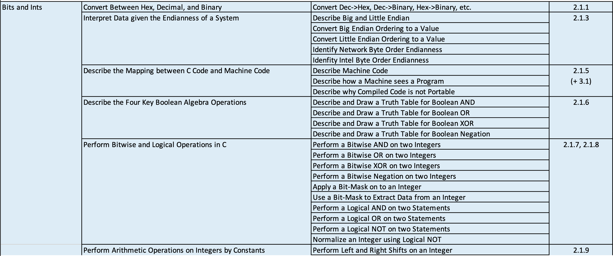
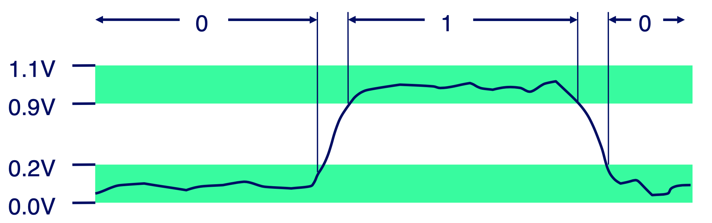
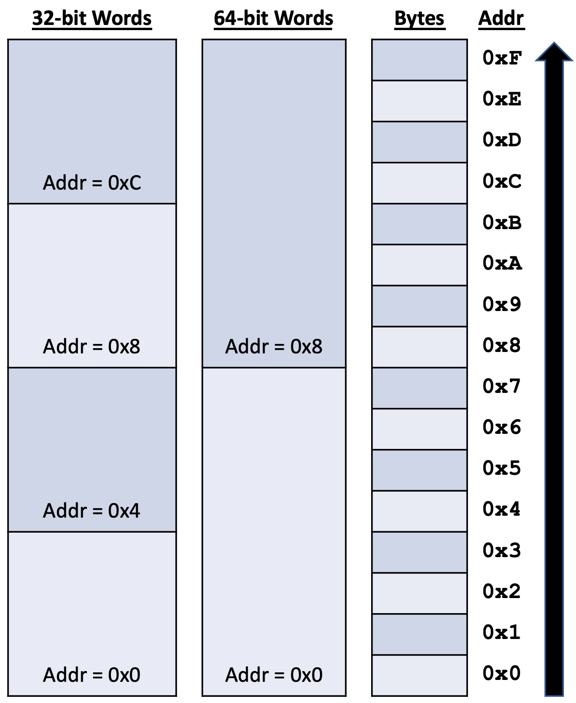
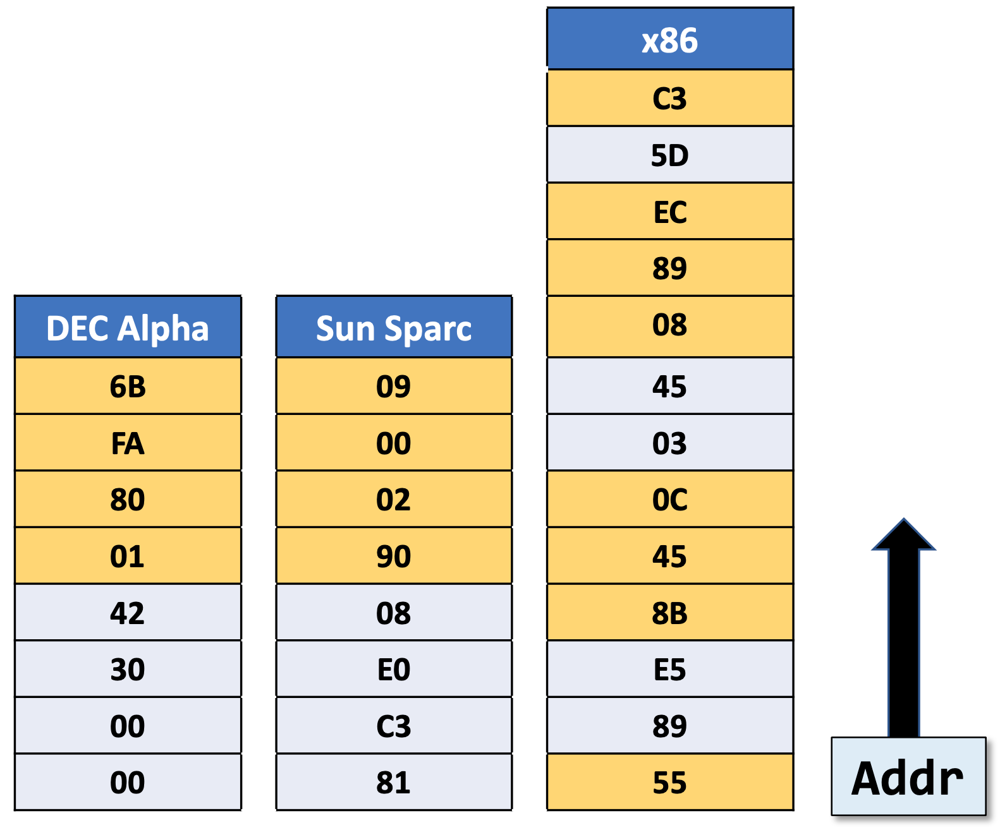
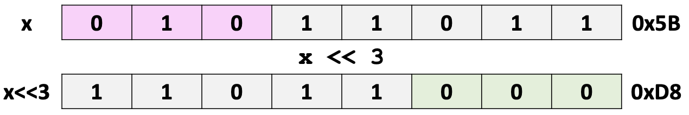
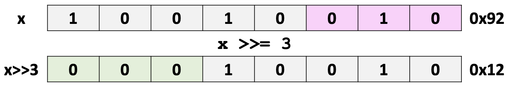
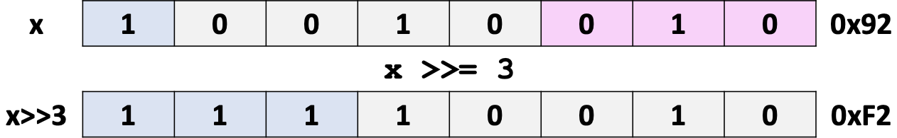

## Reading Track

This Lecture covers Chapter 2.1 (Bits and Integers)

Reading Homework:

1. Read through Chapter 2.2-2.3 (Integer Representations)
   + The next lecture covers Integer Representations and Arithmetic
2. Continue to Review C (This Friday’s Recitation is on C). This semester, you’ll be doing the following operations in Assembly Language. If you know these well in C, it will be a lot easier over the next two months:
   + Passing by reference and working with pointers in functions
   + Dereferencing values: `*ptr = 42;`
   + Pointer arithmetic with arrays: `*(ary + 3) = 42;`
   + Working with `struct`s and dynamic memory
   + Working with linked lists using dynamically allocated `struct`s

## Lecture Overview from CS262

{ width=100% }

## Everything in a system is just bits

Each bit is a zero or a one. By encoding and interpreting sets of bits in various ways:

+ Computers determine what to do (operations and instructions)
+ Computers represent and manipulate data

Why do we use bits? Well, because they're easy to store in bistable elements (like electronics).

{ width=50% }

## Number Systems

A *base* (or radix) is a mathematical building block used to describe a number system whose digits are used to represent numbers. It (as far as whole-number bases go) is the number of numerals allowed in a base, and it includes zero.

The *maximum numeral* in a base is one less than the base.

The *radix point* is a point used to separate the integer part of a number from the fractional part.

A $\beta$-Expansion is a means of rewriting a number as the digits multiplied by the base which is raised to the power of position of the digit. Some examples include:

+ $125_{10} = 1\times10^2 + 2\times10^1 + 5\times10^0$
+ A5.E$_{16} = 10\times16^1 + 5\times16^0 + 14\times16^{-1}$
+ $10_2 = 1\times2^1+0\times2^0$

The general formula is

$$\sum_{i=0}^{\omega-1} x_i \times \beta^i$$

where $x_i$ is the ith-digit and $\beta$ is the base.

### Converting to a base

The simplest way to compute a number in a different base is to repeatedly divide the number you want to convert by the base you want to convert, making a list of the remainders until you hit a quotient of zero. At that point, read the list in reverse and you've got your number!

Quotient | Remainder | List |
:-:      | :-:       | :-:  |
123 / 2 = 61 | 1 | 1 |
61 / 2 = 30 | 1 | 11 |
30 / 2 = 15 | 0 | 110 |
15 / 2 = 7 | 1 | 1101 |
7 / 2 = 3 | 1 | 11011 |
3 / 2 = 1 | 1 | 110111 |
1 / 2 = 0 | 1 | 1101111 |

Reversing the list yields $1111011_2$, which is correct! We can verify this with a $\beta$-Expansion:

$$1\times2^6 + 1\times2^5 + 1\times2^4 + 1\times2^3 + 0\times2^2 + 1\times2^1 + 1\times2^0 = 123.$$

### Converting between powers of bases

When converting between powers of bases, we can group digits, convert them individually, and concatenate the result. As an example, let's convert $1101011101_2$ to hexadecimal. Since $16=2^4$, we group the binary digits into buckets of size four. This grouping process starts at the right and continues left, padding with zeros on the left if the last bucket does not contain four digits.

$$0011 \qquad 0101 \qquad 1101$$

Converting each individually yields

$$3 \qquad 5 \qquad \text{D}$$

Concatenating the result yields 35D$_{16}$ which is correct.

This process also works in reverse. Using the same number, let's convert back to binary. Since $16=2^4$, each hexadecimal digit will produce four binary digits.

$$3 \qquad 5 \qquad \text{D}$$

$$0011 \qquad 0101 \qquad 1101$$

Concatenating the result yields 1101011101$_2$, which is correct.

### Prefixes for bases in C

To write a number in *decimal* in C is simple: write the number.

+ `int c = 255; // 255 as a decimal number`

To write a number in *binary* in C, we can take advantage of an extension GCC provides and use the `0b` prefix..

+ `int c = 0b11111111; // 255 as a binary number`

To write a number in *octal* in C, we can take advantage of a prefix provided by the language (`0`).

+ `int c = 0377; // 255 as an octal number`

To write a number in *hexadecimal* in C, we can take advantage of a prefix provided by the language (`0x`).

+ `int c = 0xFF; // 255 as a hexadecimal number`

### Arithmetic in different bases

As long as the base is a whole number base, arithmetic is performed exactly the same way that it is with decimal numbers.

## Byte-Oriented Memory Organization

+ Conceptually, memory is just a very, very large array of bytes
  + In reality, it's become *way* more complicated but we won't touch on that until much later this semester
+ An address is an index into that array of bytes
+ A pointer is a variable whose value is a memory address

Note: Operating Systems give each process a Private Address Space

+ A process is just a program which is being executed
+ This separation protects processes from malicious actors

## Word Size Data Types

C Data Type | Typical 32-bit Byte Count | Typical 64-bit Byte Count | Zeus |
:-: | :-: | :-: | :-: |
`char` | 1 | 1 | 1 |
`short` | 2 | 2 | 2 |
`int` | 4 | 4 | 4 |
`long` | 4 | 8 | 8 |
`float` | 4 | 4 | 4 |
`double` | 8 | 8 | 8 |
`long double` | N/A | 10/16 | 16 |
Pointers | 4 | 8 | 8 |

We can guarantee that the integer type sizes are consistent across architectures by using `stdint.h`.

### stdint.h

The header file `stdint.h` defines the following integer types with the associated sizes:

Signed? | Standard Data Type | 32-bit Byte Count | 64-bit Byte Count |
:-: | :-: | :-: | :-: |
Yes | `int8_t` | 1 | 1 |
No | `uint8_t` | 1 | 1 |
Yes | `int16_t` | 2 | 2 |
No | `uint16_t` | 2 | 2 |
Yes | `int32_t` | 4 | 4 |
No | `uint32_t` | 4 | 4 |
Yes | `int64_t` | 8 | 8 |
No | `uint64_t` | 8 | 8 |

There are other fun things in that header, but these are all that we'll cover.

## Addressing

Addresses specify a byte location.

+ The address of a word is the address of the first byte in the word
+ Addresses of successive words differ by the word size (eg. 32 or 64)

Each column below shows a different view of the same bytes in RAM

+ All machines are byte-addressable
+ The columns show the word addresses

{ width=50% }

## Byte Ordering

Any data which spans multiple bytes has a *byte ordering*.

+ This refers to the order of the bytes which make up that data.
+ This is only for multiple byte data types (so not `char`s or any reference data types)

There are two conventions for byte ordering:

*Big Endian*: The LSB has the highest address. This ordering is used by Sun, PowerPC, and the Internet Byte Ordering

*Little Endian*: The LSB has the lowest address. This ordering is used by Intel and AMD.

*Fun fact*: ARM is a bi-endian system -- it can be set to either.

As an example, consider how `int x = 0x1234567; &x = 0x100` would look with two different ordering schemes.

Since we take an integer to be 32 bits, we must partition `x` into four buckets of eight bits each. Then `x` would consist of `01 23 45 67`.

{ width=75% }

### Question 3

*File*: `int_endian.c`

As another example, if we run the following on Zeus, what will be printed?

```c
int x = 0x1234567;
unsigned char *bp = (unsigned char *) &x;
printf("0x%x\n", *(bp + 2));
```

Since Zeus is Little Endian, the order of our bytes will be reversed. Instead of seeing `01 23 45 67`, we'll see `67 45 23 01`. Treating it as an array of bytes (which is what `bp` is doing), the second element is `23`. As such, we'll see `0x23` printed.

## Examining Data Representations

*File*: `show_bytes.c`

We can use code to examine the byte representation of data.

+ Assign an `unsigned char *` pointer to any data to examine it
  + Remember to cast the data's address to `unsigned char *`

The following code

```c
void show_bytes(unsigned char *start, size_t len) {
  size_t i;
  for (i = 0; i < len; i++) {
    printf("%p\t0x%.2x\n", start + i, start[i]);
  }
  printf("\n");
}
```

with `long l = 0xCAFE1337DEAD1701;` prints out

```text
0x7ffe8cb58bb0  0x01
0x7ffe8cb58bb1  0x17
0x7ffe8cb58bb2  0xad
0x7ffe8cb58bb3  0xde
0x7ffe8cb58bb4  0x37
0x7ffe8cb58bb5  0x13
0x7ffe8cb58bb6  0xfe
0x7ffe8cb58bb7  0xca
```

## String Byte Ordering

Since each character is a single byte Endian-ness doesn't apply to them.

Given `char s[] = "Hello!";`, `s` will appear in memory as `'H' 'e' 'l' 'l' 'o' '!' '\0'`.

## Machine Level Code Representation

How are programs encoded in memory?

+ Each program is a sequence of operations
+ Each operation is a sequence of bytes

There are two types of program instruction encodings

+ Reduced Instruction Set Computer (RISC)
  + Each instruction (operation) is the same number of bytes
  + ARM is an example of a RISC architecture
+ Complex Instruction Set Computer (CISC)
  + Each instruction (operation) is a variable number of bytes
  + x86-64 is an example of a CISC architecture

## Representing Instruction in Memory

Let's look at a simple function

```c
int sum(int x, int y) {
  return x + y;
}
```

+ Alpha and Sun are RISC machines
  + They have two 4-byte instructions
+ x86-64 is a CISC machine
  + Seven total instructions
  + The instructions are 1, 2, or 3 bytes in length

{ width=65% }

## Instructions and Endian-ness

+ Disassembly
  + Text representation of the binary machine code
  + Generated by a program which reads machine code

```text
Address   Instruction Code      Assembly Rendition
8048365:  5b                    pop %ebx
8048366:  81 c3 ab 12 00 00     add $0x12ab %ebx
804836c:  83 bb 28 00 00 00 00  $0x0, 0x28 (%ebx)
```

+ Deciphering values
  + Value: `0x12ab`
  + Pad to 32-bits: `0x000012ab`
  + Split into bytes: `00 00 12 ab`
  + Reverse (Little Endian): `ab 12 00 00`

## Main Points

+ It's all about bits and bytes
  + Number representations
  + Programs (instruction encoding)
  + Text (ASCII/UTF-8 and binary files)
+ Different machines follow different conventions
  + Word size (8, 16, 32, or 64 bit)
  + Byte ordering (Little, Big, or Bi-Endian)
  + Data representations

## Boolean Algebra

+ Mathematical branch of algebra where expressions result in True or False
  + In computer systems, these values are denoted as
    + True: non-zero value
    + False: zero value
+ There are two types of boolean operations in C: Logical and Bitwise
  + Logical operations only result in True or False
  + Bitwise operations perform boolean operations pairwise, to all the bits in the operands
    + The final result is a sequence of bits, each of which is the result of the boolean operation on a pair of corresponding bits

As an example, consider the result of performing `0x3C && 0x95`.

*File*: `logic.c`

As non-zero integer values, both of them are equivalent to true, so `0x3C && 0x95 == TRUE`.

*Omitted slide 35, Section 2.1.8, definitions of several logical operators.*

Let's revisit our previous example, but instead use a bitwise and: `0x3C & 0x95`.

{ width=65% }

*Omitted slide 37, Section 2.1.6, definitions of several bitwise operators.*

## General Boolean Expressions

### Question 4

Given that

$$ \text{A} = 49_{16} = 1001001_2$$

and

$$ \text{B} = 55_{16} = 1010101_2$$

what are the results of `A&B`, `A|B`, `A^B`, and `~B`?

Expression | Value |
:-: | :-: |
`A&B` | `0x41` |
`A|B` | `0x5D` |
`A^B` | `0x1C` |
`~B` | `0xAA` |

## Bitwise Expressions in C

*File*: `question4.c`

Consider the following C snippet:

```c
unsigned char A = 0x49;
unsigned char B = 0x55;
printf("0x%.2x\n", A&B);
printf("0x%.2x\n", A|B);
printf("0x%.2x\n", A^B);
printf("0x%.2x\n", (unsigned char)~B);
printf("0x%.2x\n", ~B);
printf("0x%.2x\n", ~B & 0xFF);
```

The above snipped prints out

```text
0x41
0x5d
0x1c
0xaa
0xffffffaa
0xaa
```

The value of `~B` printed out should give us pause. Why is do we need to mask out bits that don't exist in the `char` data type?

Let's double check the data types after performing operations on them.

```c
unsigned char A = 0x49;
unsigned char B = 0x55;
printf("   A is %d Bytes\n", sizeof(A));
printf("   B is %d Bytes\n", sizeof(B));
printf(" A&B is %d Bytes\n", sizeof(A&B));
printf(" A|B is %d Bytes\n", sizeof(A|B));
printf(" A^B is %d Bytes\n", sizeof(A^B));
printf("  ~B is %d Bytes\n", sizeof(~B));
printf("A&&B is %d Bytes\n", sizeof(A&&B));
printf("A||B is %d Bytes\n", sizeof(A||B));
printf("  !B is %d Bytes\n", sizeof(!B));
```

When run, this prints out

```text
   A is 1 Bytes
   B is 1 Bytes
 A&B is 4 Bytes
 A|B is 4 Bytes
 A^B is 4 Bytes
  ~B is 4 Bytes
A&&B is 4 Bytes
A||B is 4 Bytes
  !B is 4 Bytes
```

Everything is an `int` now -- this is the result of *integer promotion*, which applies to all arithmetic operations on `char`s and `short`s.

## Bitwise Masking

*File*: `mask.c`

### Turning bits on with `OR`

Suppose that you have a `char` and you want to turn on bit 2 and bit 1 (remember, this is zero-indexed so we're not talking about bit 1 and bit 0). One way we can do this is with a mask and an `OR` operation:

```c
value  = 0x2A; // 00101010
mask   = 0x06; // 00000110
value |= mask; // 00101110
```

### Turning bits off with `AND`

Suppose that you have a `char` and you want to turn off bit 2 and bit 1. We can do this with a mask and an `AND` operation.

```c
value  = 0x2A; // 00101010
mask   = ~0x6; // 11111001
value &= mask; // 00101000
```

### Toggling bits with `XOR`

Suppose that you have a `char` and you want to toggle (flip) whatever bit 2 and bit 1 are. We can do this with a mask and an `XOR` operation.

```c
value  = 0x2A; // 00101010
mask   = 0x06; // 00000110
value ^= mask; // 00101100
```

## Shift Operations

C lets you shift bits within data types left (`<<`) or right (`>>`).

However, according to the standard (§6.5.7):

> The integer promotions are performed on each of the operands. The type of the result is that of the promoted left operand. If the value of the right operand is negative or is greater than or equal to the width of the promoted left operand, the behavior is undefined.
>
> The result of `E1 << E2` is `E1` left-shifted `E2` bit positions; vacated bits are filled with zeros. If `E1` has an unsigned type, the value of the result is `E1` $\times$ `2`$^\text{E2}$, reduced modulo one more than the maximum value representable in the result type. If `E1` has a signed type and nonnegative value, and `E1` $\times$ `2`$^\text{E2}$ is representable in the result type, then that is the resulting value; otherwise, the behavior is undefined.
>
> The result of `E1 >> E2` is `E1` right-shifted `E2` bit positions. If `E1` has an unsigned type or if `E1` has a signed type and a nonnegative value, the value of the result is the integral part of the quotient of `E1 / 2`$^\text{E2}$. If `E1` has a signed type and a negative value, the resulting value is implementation-defined.

### Left Shift

{ width=65% }

+ Shifts the bits in a value `x` to the left by `k` bits
+ Fills in with zeros on the right
+ Shifting $\omega$-bit value `x` left by `k` is the same as $(x\times 2^k) \mod (2^\omega)$

### Logical Right Shift

+ Used with unsigned integer types
+ Shifting $\omega$-bit value `x` right by `k` is the same as $\lfloor \frac{x}{2^k}\rfloor$

{ width=65% }

### Arithmetic Right Shift

+ Used with signed integer types
+ Shifting $\omega$-bit value `x` right by `k` is the same as $\lfloor \frac{x}{2^k}\rfloor$ *in two's complement*

{ width=65% }

## Example: Representing Sets

We can use bitwise operations to represent sets

Set | 7   | 6   | 5   | 4   | 3   | 2   | 1   | 0   |
:-: | :-: | :-: | :-: | :-: | :-: | :-: | :-: | :-: |
$A$ | 0 | 1 | 1 | 0 | 1 | 0 | 0 | 1 |
$B$ | 0 | 1 | 0 | 1 | 0 | 1 | 0 | 1 |

We can interpret this as $A = \{0, 3, 5, 6\}$ and $B = \{0, 2, 4, 6 \}$.

There are some nice translations between bitwise operators and operations on sets.

Expression | Result   | Set members |
-:        | :-:      | :-         |
`A&B`      | `01000001` | $\{0, 6\}$  |
`A|B`      | `01111101` | $\{0, 2, 3, 4, 5, 6\}$ |
`A^B`      | `00111100` | $\{2, 3, 4, 5\}$ |
`~B`       | `10101010` | $\{1, 3, 5, 7\}$ |
