## Reading Track

This Lecture covers Chapters 2.2 and 2.3 (Integers and Integer Arithmetic)

Reading Homework:

1. Read through Chapter 2.4 (Floating Point)
   + Also continue to review Chapter 2.1-2.3 in its entirety
   + We'll spend the next several classes finishing up through Chapter 2.4
2. Continue to Review C. This semester, you’ll be doing the following operations in Assembly Language. If you know these well in C, it will be a lot easier over the next two months:
   + Passing by reference and working with pointers in functions
   + Dereferencing values: `*ptr = 42;`
   + Pointer arithmetic with arrays: `*(ary + 3) = 42;`
   + Working with `struct`s and dynamic memory
   + Working with linked lists using dynamically allocated `struct`s

## Lecture Overview from CS262

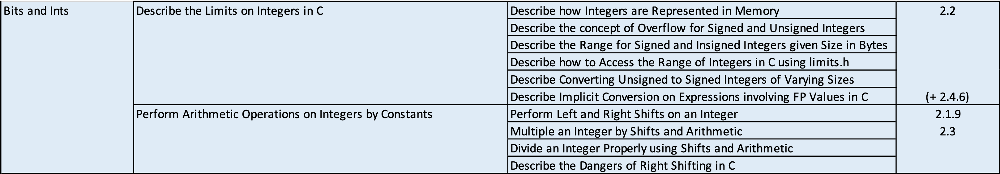{ width=100% }

## Note on Endian-ness and Operations

For most applications that we will write in this class, the Endian-ness of a machine isn't something that we'll need to concern ourselves with.

Operations, even when done in C or Assembly, operate on a multi-byte integers as we would expect them to, if they were just large binary values.

Knowing about Endian-ness is only needed when we want to examine how the CPU stores integers in memory, looking at it byte by byte.

## Integer Representation

### Unsigned Integers

With unsigned integers, all bits have the same magnitude that they do in binary. We can use notation to explain this:
  $$
  \sum_{i=0}^{\omega - 1} x_2 \times 2^i
  $$
where $\omega$ is the number of bits, and $x_i$ is the bit at position $i$ (zero-indexed from the Least Significant Bit (LSB)).

### Signed Integers

Most machines use two's complement when they encode bits.

With the two's complement, all bits have the same magnitude as they would in binary. However, the Most Significant Bit (MSB) of the data type has a negative value. Mathematically,
  $$
  -x_{\omega-1} \times 2^{\omega-1} + \sum_{i=0}^{\omega - 2} x_2 \times 2^i
  $$
where $\omega$ is the number of bits, and $x_i$ is the bit at position $i$ (zero-indexed from the LSB).

### Question 1

Unsigned 8-bit binary integers to decimal:

Note | Binary | Decimal |
:-     | :-: | -: |
`UMIN` | `00000000` | 0 |
None   | `10000000` | 128 |
None   | `01111111` | 127 |
`UMAX` | `11111111` | 255 |

### Question 2

Unsigned 8-bit binary integers to decimal:

Note | Binary | Decimal |
:-     | :-: | -: |
None   | `00000000` | 0 |
`TMIN` | `10000000` | -128 |
`TMAX` | `01111111` | 127 |
None   | `11111111` | -1 |

### Adding one repeatedly

Let's consider what happens when we repeatedly add one to an 8-bit number, looking at it as both a signed and unsigned integer.

Unsigned | Binary | Signed |
:-       | :-:    | -:     |
0 | `00000000` | 0 |
1 | `00000001` | 1 |
$\vdots$ | $\vdots$ | $\vdots$ |
127 | `01111111` | 127 |
128 | `10000000` | -128 |
$\vdots$ | $\vdots$ | $\vdots$ |
255 | `11111111` | -1 |

## Integer Ranges

In general, with an $n$-bit data type, you have an unsigned range of
  $$
  [0, 2^n - 1]
  $$
and a signed range of
  $$
  [2^{n-1}, 2^{n-1} - 1]
  $$
with two's complement.

The limits for different data types are in `limits.h` and `stdint.h`.

## Negating a Number

With signed integers in two's complement, we can negate values using the following process:

+ Flip all of the bits
+ Add one

Take for example the following snippet:

```c
char x = 5; // x = 00000101
x = ~x + 1; // x = 11111011
x = ~x + 1; // x = 00000101
```

Performing the operation twice returns us to our original value.

## Unsigned and Signed Values

*Omitted slide 15.*

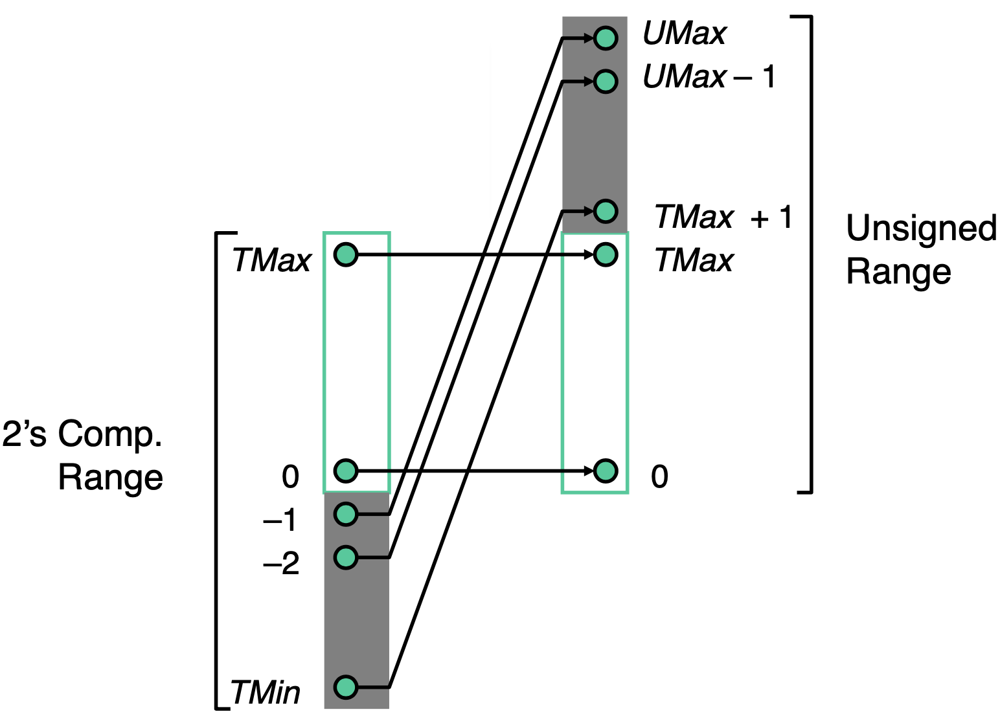{ width=50% }

### Two's complement to unsigned conversion

*Note:* Converting between signed and unsigned does not change the bits -- it's really just telling the program how to interpret that region of memory.

$$
T2U(x) = \begin{cases}
  x, & x \geq 0 \\
  x + w^\omega, & x < 0
\end{cases}
$$

*Example*: Convert 8-bit value `-1` to an unsigned number.

Since $x < 0$, we use $T2U(x) = x + 2^\omega$. Substituting, $T2U(-1) = -1 + 256 = 255$.

### Unsigned to two's complement conversion

$$
U2T(u) = -u_{\omega - 1} \times 2^\omega + u
$$

*Example*: Convert 8-bit value `255` to an signed number.

Evaluating $U2T(255)$ yields $-256+255$ which is equivalent to $-1$.

## Signed and Unsigned in C

### Constants

+ Constant values in code are treated as signed integers.
  + To treat them as unsigned, add the `U` suffix:
    + `x += 429496725;` becomes `x += 429496725U;`

### Casting

+ You can explicitly cast between signed and unsigned data types
+ This is is the same thing as using $U2T$ or $T2U$: the bits are unchanged
  + `uy = (unsigned int) ty;`
+ C will also implicitly cast if needed
  + `int tx = uy; // may throw compiler warning`

## Casting Surprises

*File*: `casting.c`

### Question 3

Consider the following table (the constants are all 32-bit integers, so `TMAX = 2147483647` and `TMIN = -2147483648`).

Constant 1 | Constant 2 |Signed or Unsigned Evaluation? | Relation? ==, <, or >
:-: | :-: | :-: | :-: |
0 | 0U | Unsigned | Constant 1 == Constant 2 |
-1 | 0 | Signed | Constant 1 < Constant 2 |
-1 | 0U | Unsigned | Constant 1 > Constant 2 |
2147483647 | -2147483648 | Signed | Constant 1 > Constant 2 |
2147483647U | -2147483648 | Unsigned | Constant 1 < Constant 2 |
-1 | -2 | Signed | Constant 1 > Constant 2 |
(unsigned) -1 | -2 | Unsigned | Constant 1 > Constant 2 |
2147483647 | 2147483648U | Unsigned | Constant 1 < Constant 2 |
2147483647 | (int) 2147483648U | Signed | Constant 1 > Constant 2 |

## Zero Extension

When we cast an unsigned integral data type to a larger unsigned integral data type it is padded with leading zeros.

This does not change the value.

## Signed Extension

When we cast a signed integral data type to a larger signed integral data type it is padded with whatever the MSB was.

This does not change the value.

*Omitted slide 23.*

*File:* `sign.c`

As an example, consider the following C snippet:

```c
short x = 15213; // 0x3b6d
int ix = (int) x;
short y = -15213; // 0xc493
int iy = (int) y;
```

Type | Decimal | Hex | Binary |
-: | -: | -: | -: |
`short x` | 15213 | 3B 6D | 00111011 01101101 |
`int ix` | 15213 | 00 00 3B 6D | 00000000 00000000 00111011 01101101 |
`short y` | -15213 | C4 93 | 11000100 10010011 |
`int iy` | -15213 | FF FF C4 93 | 11111111 11111111 11000100 10010011 |

Running it yields

```bash
$ ./sign 6d 3b
6d 3b 00 00
93 c4
93 c4 ff ff
```

## Truncation

+ The opposite of extension
+ Reduces an integer to a smaller data type
+ Chops off the higher-order bits
+ This process can change the value if the new size is too small

## When to use Unsigned

*File*: `mod.c`

+ Essentially only use it if you're
  + Performing modular arithmetic
  + When you absolutely need an extra bit worth of range

## Unsigned Integer Addition

### Modular arithmetic

The sum of two unsigned value may overflow. It is in effect a modular sum: $u + v = (u + v) \mod 2^\omega$. It will wrap at most once. It follow that the true sum will require at most $\omega+1$ bits to represent. The discarded bit is called the *carry*.
  $$
  UAdd_\omega(u,v) = \begin{cases}
    u+v, & u + v < 2^\omega \\
    u+v - 2^\omega, & u + v \geq 2^\omega
  \end{cases}
  $$

The result of the $UAdd$ function looks like modulo-$\omega$ applied to $z=x+y$ in the first octant of $\mathbb{R}^3$.

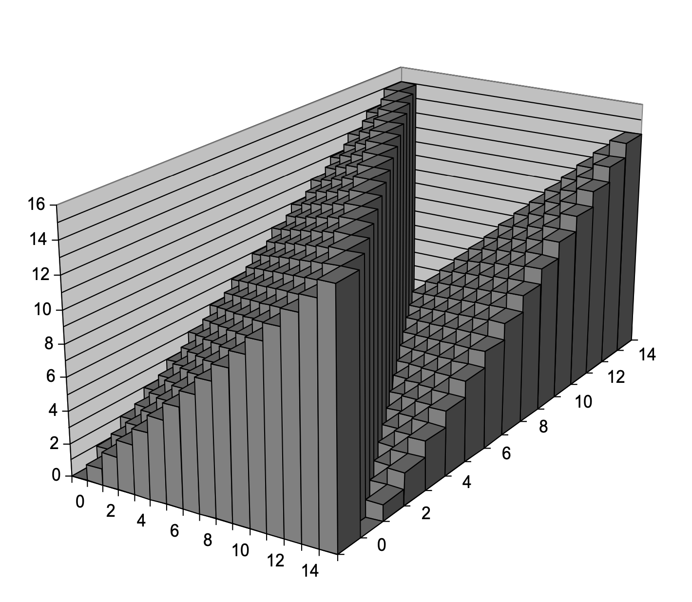{ width=50% }

## Detecting Overflow in Unsigned Addition

If $u + v < u$ or $u + v < v$ then you had an overflow.

## Two's Complement Integer Addition

Essentially, we see the same behavior as we did with unsigned integer addition. We still have the carry, and the true sum still requires at most $\omega+1$ bits. This is largely due to the fact that the Arithmetic Logic Unit (ALU) only sees bits and does not interpret them.

*Note*: If you add a positive and a negative number, you'll never have an overflow.

## Characterizing Signed Addition

### Functionality

+ The true sum requires up to $\omega+1$ bits
+ This means that MSB may be truncated
+ The remaining bits are treated as signed bits
  $$
  TAdd_\omega = \begin{cases}
    u+v - 2^\omega, & TMax_\omega < u + v \\
    u+v, & TMin_\omega \leq u + v \geq TMax_\omega\\
    u+v + 2^\omega, & u + v < TMin_\omega \\
  \end{cases}
  $$
+ In the first case, we handle positive overflow (positive plus positive yields negative)
+ In the last case, we handle negative overflow (negative plus negative yields positive)

## Visualizing Two's Complement Addition

Consider what happens with a 4-bit data type.

+ Range of [-8,7]
+ If $u + v \geq 2^{\omega - 1}$ (greater than `TMax`) it becomes negative
+ If $u + v < -2^{\omega - 1}$ (less than `TMin`) it becomes positive (or zero)

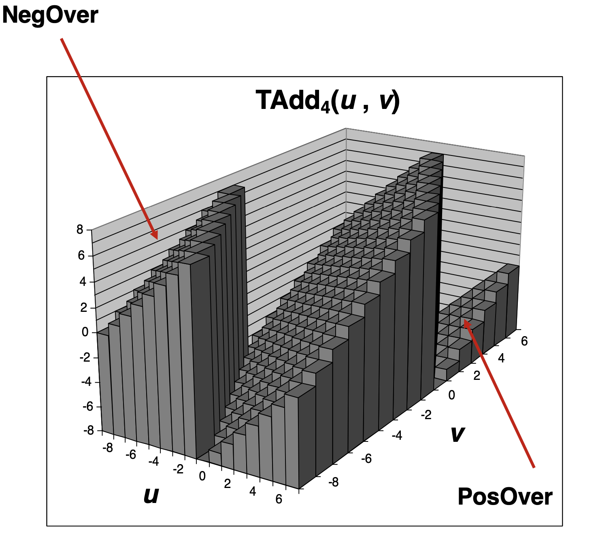{ width=50% }

## Detecting Signed Overflow

Type of Overflow | Criteria |
:-: | :-: |
Negative Overflow | $u < 0, v < 0, u + v \geq 0$ |
Positive Overflow | $u \geq 0, v \geq 0, u + v <> 0$ |
Overflow | Operands have the same sign, but the sum is a different sign |

We can express the last one as a boolean statement in C:

```c
(u < 0 == v < 0) && (u < 0 != sum < 0)
```

## Practice with Additions

For each problem, is there an overflow? Consider the additions as both 4-bit unsigned integers and 4-bit signed integers.

```text
 1001
+1011
-----
10100
```

As two unsigned integers, since there is a carry of one we have an unsigned overflow. As two signed integers, since both are negative and the sign of the sum is not the same (it is positive), we have a signed overflow.

```text
 1001
+0111
-----
10000
```

As two unsigned integers, since there is a carry of one we have an unsigned overflow. As two signed integers, since the signs of the summands are different we cannot have a signed overflow.

## Integer Addition -- Summary

Addition is applied at the bit-level, regardless of whether the integral data type is signed or unsigned. The only difference is in how we detect overflows:

+ Unsigned Integral Types
  + Overflow $\iff$ carry bit is one
+ Signed Integral Types
  + Overflow $\iff$ the sign of the summands are the same and the sign of sum does not match the sign of the summands
    + Corollary: if the summands are different signs we will never have an overflow

## Shift Operations

C lets you shift bits within data types left (`<<`) or right (`>>`).

However, according to the standard (§6.5.7):

> The integer promotions are performed on each of the operands. The type of the result is that of the promoted left operand. If the value of the right operand is negative or is greater than or equal to the width of the promoted left operand, the behavior is undefined.
>
> The result of `E1 << E2` is `E1` left-shifted `E2` bit positions; vacated bits are filled with zeros. If `E1` has an unsigned type, the value of the result is `E1` $\times$ `2`$^\text{E2}$, reduced modulo one more than the maximum value representable in the result type. If `E1` has a signed type and nonnegative value, and `E1` $\times$ `2`$^\text{E2}$ is representable in the result type, then that is the resulting value; otherwise, the behavior is undefined.
>
> The result of `E1 >> E2` is `E1` right-shifted `E2` bit positions. If `E1` has an unsigned type or if `E1` has a signed type and a nonnegative value, the value of the result is the integral part of the quotient of `E1 / 2`$^\text{E2}$. If `E1` has a signed type and a negative value, the resulting value is implementation-defined.

### Left shift

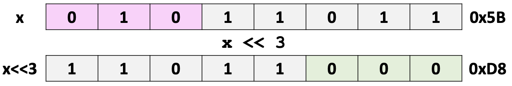{ width=65% }

+ Shifts the bits in a value `x` to the left by `k` bits
+ Fills in with zeros on the right
+ Shifting $\omega$-bit value `x` left by `k` is the same as $(x\times 2^k) \mod (2^\omega)$

#### Without overflow

Consider the case where we perform `0101 1011 << 1`:

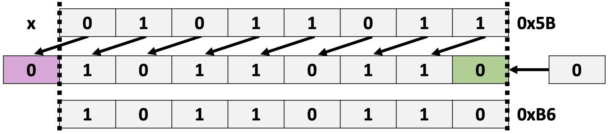{ width=65% }

Arithmetically,

+ `0x5B` $= 91$
+ $91 \times 2^1 = 182$
+ $182 \mod 2^8 = 182$
+ $82 =$ `0xB6`

There's no overflow because we don't lose any value-carrying bits.

#### With overflow

Consider the case where we perform `1011 0110 << 1`:

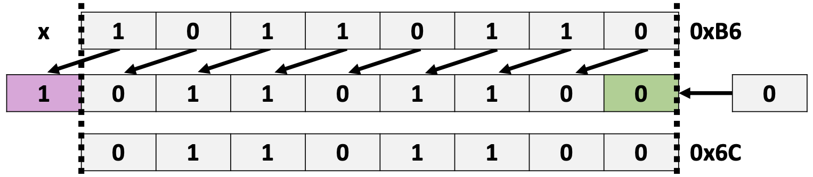{ width=65% }

Arithmetically,

+ `0xB6` $= 182$
+ $182 \times 2^1 = 364$
+ $364 \mod 2^8 = 108$
+ $108 =$ `0x6C`

There's an overflow because we lose a value-carrying bit.

### Power-of-2 multiplication by shifting

Operation `u << k` gives you $u\times2^k$. This works for both signed and unsigned numbers.

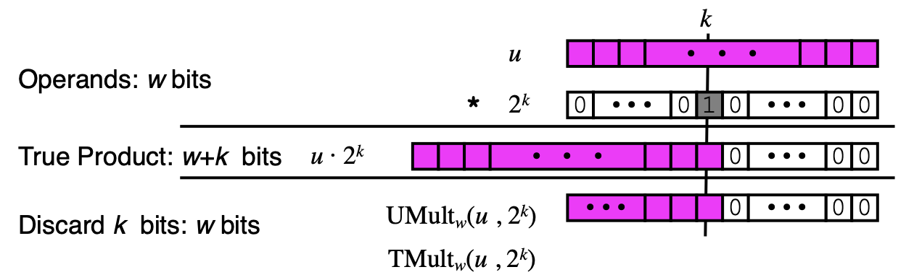{ width=70% }

#### Question 5

Express the following as sum or differences of the results of shifts.

+ `8u`
  + `u << 3`
+ `24u`
  + `(u << 5) - (u << 3)`
  + `(u << 4) + (u << 3)`

### Logical right shift

+ Used with unsigned integer types
+ Shifts in zeros from the left
+ Shifting $\omega$-bit value `x` right by `k` is the same as $\lfloor \frac{x}{2^k}\rfloor$

Consider the case where we perform `0101 1010 >> 1`:

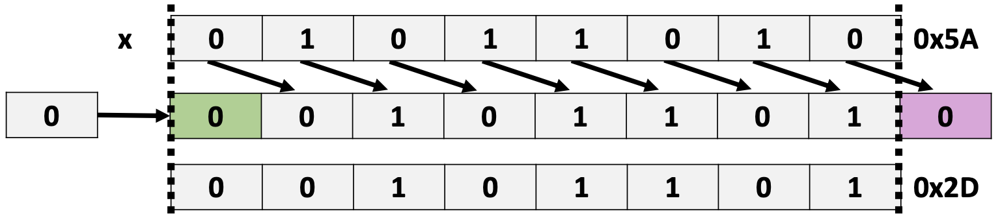{ width=65% }

Arithmetically,

+ `0x5A` $= 90$
+ $90 \div 2^1 = 45$
+ $\lfloor 45\rfloor = 45$
+ $45 =$ `0x2D`

### Arithmetic right shift

+ Used with signed integer types
+ Shifts in copies of the MSB from the left
+ Shifting $\omega$-bit value `x` right by `k` is the same as $\lfloor \frac{x}{2^k}\rfloor$ *in two's complement*

#### Positive signed integral

Consider the case where we perform `0101 1010 >> 1`:

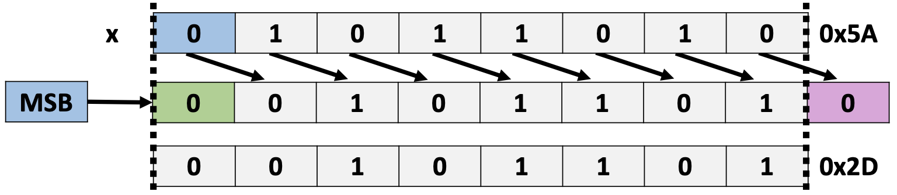{ width=65% }

Arithmetically,

+ `0x5A` $= 90$
+ $90 \div 2^1 = 45$
+ $\lfloor 45\rfloor = 45$
+ $45 =$ `0x2D`

We see that it is equivalent to the logical right shift.

#### Negative signed integral

Consider the case where we perform `1101 1010 >> 1`:

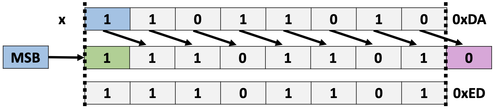{ width=65% }

Arithmetically,

+ `0xDA` $= -38$
+ $-38 \div 2^1 = -19$
+ $\lfloor -19\rfloor = -19$
+ $-19 =$ `0xED

*Omitted slide 52.*

### Power-of-2 signed divide by shifting

Operation `x >> k` gives you $\lfloor x \div 2^k \rfloor$.

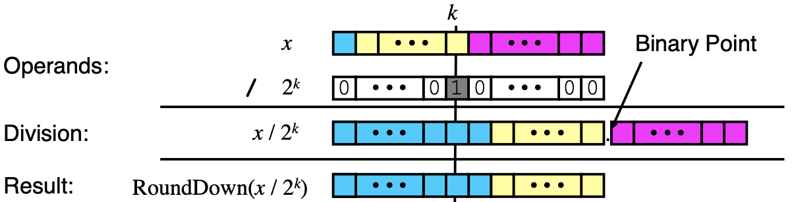{ width=70% }

Examples:

+ `u/2`
  + If `u = 3`, then `u >> 1` is equal to one, as expected
  + If `u = -3`, then `u >> 1` is equal to $-2$ which isn't what we wanted. What happened?
    + The floor function behaved as it was supposed to. We can think of it as rounding towards $-\infty$ instead of towards zero, which is what we want.
    + Instead, we should use the *ceiling* function if our operand is negative.

#### Fixing power-of-2 signed division by shifting

We have two cases:

1. $x$ divides evenly into $2^k$ in which case we have a remainder of zero
2. $x$ does not divide evenly into $2^k$ in which case we have a remainder in the range of $[1, 2^k -1]$

In the first case the division by shifting behaves as expected. In the second case it does not. Our goal is to add some value to $x$ before performing the division such that if we have a remainder (e.g. we fall into the second case) the sum of our added term and the remainder are large enough to bump the quotient up by one.

We can achieve this effect by adding the largest possible remainder, $2^k - 1$, to $x$ before dividing. With this sum, if $x$ divides evenly we get $2^k - 1$ as a remainder. That remainder is effectively thrown away be the floor function. If $x$ does not divide evenly, then because the remainder is in $[1, 2^k -1]$ the sum of the remainder and $2^k - 1$ will always be equal to one after the floor function is applied.

Our fix is then:
  $$
  \left\lfloor \frac{x+2^k - 1}{2^k} \right\rfloor = \left\lfloor \frac{x-1}{2^k}  + 1 \right\rfloor.
  $$
We can write this in C as

```c
(x + (1 << k) - 1) >> k;
```

Remember however that this fix is only for negative values, and that for all $x<0$ this is equivalent to $\lceil \frac{x}{2^k} \rceil$.

We can see through the following two examples that our fix does indeed work (using $\lfloor (x+2^k - 1) \div 2^k \rfloor$):

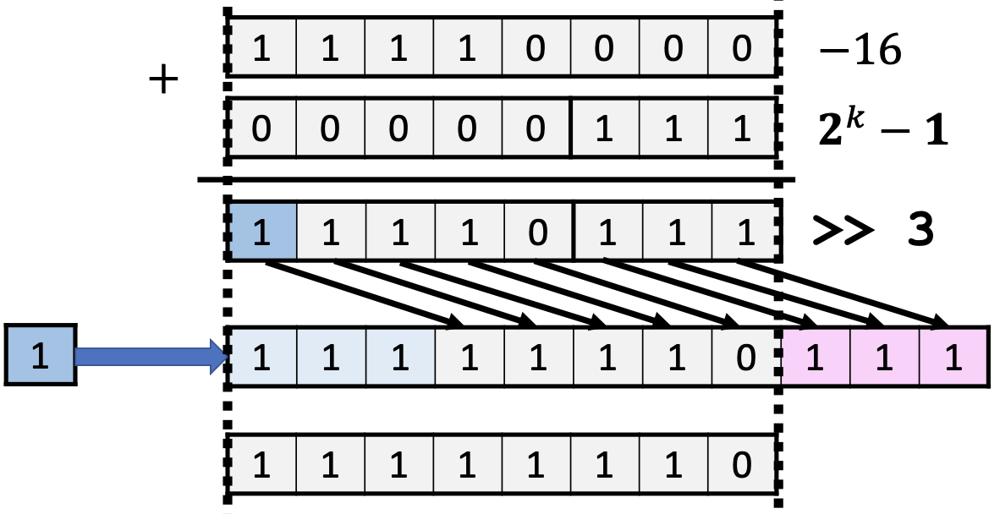{ width=50% }

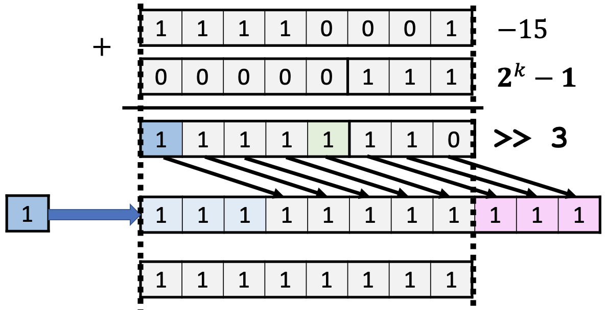{ width=50% }
