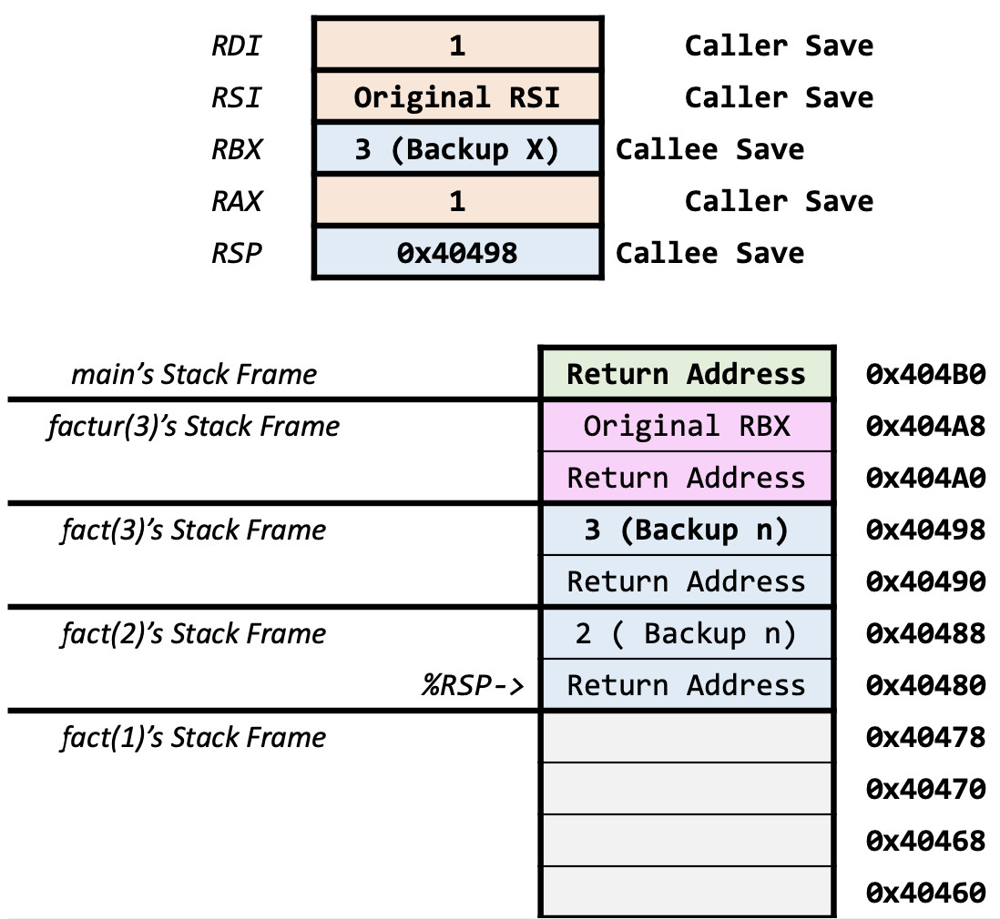
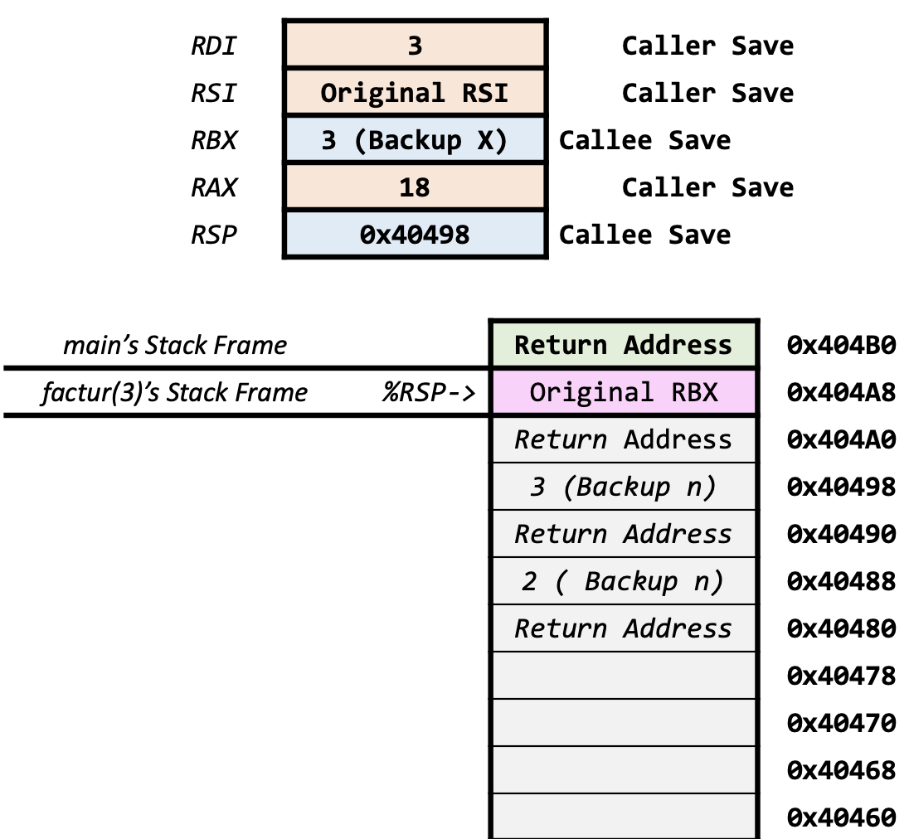

## Reading Track

This Lecture covers Chapters 3.7 (Assembly Procedures). We’ll spend several classes on each of the Assembly Lectures.

Reading Homework:

1. Read through Chapter 3.8-3.9 (x86-64 Arrays and Structures)
2. Continue to Review Chapters 3.1-3.7
    This semester we’ll be working with all of these topics in Assembly
   + Basic Operand Forms (Register, Immediate, Dereferencing)
   + Moving Data with and without Dereferencing
   + Control Flow
   + Procedures with and without Recursion
   + Using Callee-Save Registers or the Stack for saving Values

## Lecture Overview

{ width=100% }

## Procedures

+ Procedures allow us to pass Control to a Block of Code, then Return
+ We Pass Data via Arguments
  + Generally passed through Registers Return Value is returned through RAX
+ We Manage Memory
  + Allocate memory on the Stack
  + Deallocate memory on Return
+ Call/Return is done with Machine Instructions

## x86-64 Stack (Process Address Space)

+ Procedures use the Stack
  + Managed with Stack Discipline
+ Operations that use this Stack
  + `push`: Adds a Value to the Stack
  + `pop`: Removes a Value from Stack
  + `call`: Pushes RIP on to the Stack
    + Then Jumps to the Function Label
  + `ret`: Pops RIP from the Stack

{ width=35% }

## x86-64 Stack Push

Pushing (adding a value to the stack) is done with `pushq src`. It

1. Decrements `%rsp` by 8
   + This extends the stack size
2. Copy operand from `src` to address in `%rsp`

For example, `pushq $0x42` would perform the following sequence of operations.

{ width=33% } 
{ width=33% }
{ width=33% }

## x86-64 Stack Pop

Popping (removing a value from the stack) is done with `popq dest`. It

1. Copy the address from `%rsp` and write to dest
2. Increments `%rsp` by 8
   + This shrinks the stack size

For example, `popq %rax` would perform the following sequence of operations.

{ width=33% }
{ width=33% }
{ width=33% }

## x86-64 Stack

Every function call uses your stack. That `0x42` is still there at `-8(%rsp)`... for now. Calling *any* function would overwriteit.

That is why it is unsafe ot access local variable references after a return from that function. The values may have already been overwritten.

## x86-64 Procedure Call

We can call a procedure by doing `call label`. This

1. Pushes `RIP` on to the stack to save it (this is your return address!)
2. Jumps to the label

## x86-64 Procedure Return

We return from a procedure by using `ret`. This pops the top value of the stack into `RIP` and returns.

## x86-64 Procedure Call Example

Suppose we have the following object dump

```asm
804854e: e8 3d 06 00 00     call   8048b90 <foo>
8048553: 50                 pushq  %rax
...
8048b90: 83                 xorq %rax, %rax
8048b91: c3                 ret
```

Let's trace through it.

With our call instruction, our stack is set up as

{ width=45% }

Then, `RIP` advances at the beginning of the `call` instruction being parsed. When the call happens, this is where `RIP` is pointing.

{ width=45% }

The next instruction after the `call` in `main` is now on the stack (it's our return address).

{ width=45% }

Now we execute the function `foo`.

{ width=45% }

This operation only sets `%rax` to zero. We return from this procedure by popping the data the `%rsp` is pointing at back into `RIP`. This makes our next instruction the one immediately after `call`.

{ width=45% }

We've returned to `main` and `%rax` is zero, as set by `foo`.

## Procedure Data Flow (Arguments)

We return values from a procedure by putting them into `%rax`. We pass arguments into a procedure by using registers and the stack.

The following registers are typically used as follows for arguments for procedures:

Register | Argument # |
:- | :-: |
`%rdi` | Argument 1 |
`%rsi` | Argument 2 |
`%rdx` | Argument 3 |
`%rcx` | Argument 4 |
`%r8` | Argument 5 |
`%r9` | Argument 6 |
`%rax` | Return Value |

## Procedure Data Flow (More Arguments)

What if we need more than 6 arguments?

We can use any additional Arguments are pushed on to the Stack in reverse order:

{ width=75% }

## Example -- Procedure Call

*File:* `add8.s`

Let's look at calling a function with eight arguments. The following C function translates from 

```c
int main() {
  long result = add8(1,2,3,4,5,6,7,8);
  return result;
}
long add8(long a, long b, long c, long d, long e, long f, long g, long h) {
  return a+b+c+d+e+f+g+h;
}
```

into

```asm
movq $1, %rdi # Copy 1 as Arg 1
movq $2, %rsi # Copy 2 as Arg 2
movq $3, %rdx # Copy 3 as Arg 3
movq $4, %rcx # Copy 4 as Arg 4
movq $5, %r8  # Copy 5 as Arg 5
movq $6, %r9  # Copy 6 as Arg 6
pushq $8      # Copy 8 as Arg 8
pushq $7      # Copy 7 as Arg 7
callq add8
```

Up through loading into `%r9` the values appear in the registers as follow

Register | Value |
:- | :-: |
`%rdi` | 1 |
`%rsi` | 2 |
`%rdx` | 3 |
`%rcx` | 4 |
`%r8` | 5 |
`%r9` | 6 |

Before the first `pushq` is invoked, our stack might look like

`RSP`? | Value | Address |
:-: | :-: | :-: |
`RSP` | Garbage | `0x118` |
| | `0x110` |
| | `0x108` |
| | `0x100` |

After `pushq $8` is executed, we have

`RSP`? | Value | Address |
:-: | :-: | :-: |
| Garbage | `0x118` |
`RSP` | 8 | `0x110` |
| | `0x108` |
| | `0x100` |

After the last `pushq`, we have

`RSP`? | Value | Address |
:-: | :-: | :-: |
| Garbage | `0x118` |
| 8 | `0x110` |
`RSP` | 7 | `0x108` |
| | `0x100` |

After the `callq` we have

`RSP`? | Value | Address |
:-: | :-: | :-: |
| Garbage | `0x118` |
| 8 | `0x110` |
| 7 | `0x108` |
`RSP` | Return Address  | `0x100` |

Assume that the `add8` procedure is as follows:

```asm
leaq (%rdi, %rsi), %rax # a+b
leaq (%rdx, %rcx), %rdi # c+d
leaq (%r8, %r9), %rsi   # e+f
addq 8(%rsp), %rax      # a+b+g
addq 16(%rsp), %rax     # a+b+g+h
addq %rdi, %rax         # a+b+c+d+g+h
addq %rsi, %rax         # a+b+c+d+e+f+g+h
ret
```

Then the sum would occur as expected.

It is important to note that you very much can put temporary values on the stack. However, *you *must* `pop` everything off to make sure that the `%rsp` points to the return address before returning.

It's often convenient to use `%rbp` to hold the bottom of the stack. A common pattern upon entry to a function is

```asm
pushq %rbp
movq %rsp, %rbp
```

This stores the old `%rbp` and sets the `%rbp` to `%rsp`.

## Stack Frames

+ Contents
  + Local variables
  + Return information
  + Temporary space
+ Management
  + Space allocated when entering a procedure
  + De-allocation when returning from the procedure
+ Pointers
  + Stack pointer `%rsp` indicates the stack top
  + Optional frame pointer `%rbp` indicates the start of the current frame

Consider the following C functions

```c
long main() {
  long result = addfact(2,3);
  return result;
}
long addfact(long a, long b) {
  long fa = fact(a);
  long fb = fact(b);
  return fa + fb;
}
long fact(long n) {
  if(n == 1) {
  return n; }
  return n * fact(n-1);
}
```

The following stack frames follow the execution of `main` (read left to right).

```{=latex}
\newpage
```

{ width=33% }
{ width=33% }
{ width=33% }

```{=latex}
\vspace*{\fill}
\rule{\textwidth}{0.5pt}
\vspace*{\fill}
```

{ width=33% }
{ width=33% }
{ width=33% }

```{=latex}
\vspace*{\fill}
\rule{\textwidth}{0.5pt}
\vspace*{\fill}
```

{ width=33% }
{ width=33% }
{ width=33% }

```{=latex}
\vspace*{\fill}
\rule{\textwidth}{0.5pt}
\vspace*{\fill}
```

{ width=33% }
{ width=33% }
{ width=33% }

```{=latex}
\newpage
```

{ width=33% }

```{=latex}
\newpage
```

## Linux Stack Frame for x86-64

+ Current stack frame ("Top" to Bottom)
+ "Argument build"
  + Parameters for a function about to call
  + Local variables
    + If we can't keep them in registers
  + Saved register context
  + Old frame pointer (the `%rbp`, which is optional)
+ Caller stack frame
  + Return address
    + Pushed by `call` instruction
  + Arguments for this `call`

{ width=35% }

## Register Saving Conventions

### Caller Save

The caller function saves these registers in its stack frame before calling a function. We do so because the callee can change these registers.

If you have a value in a caller save register that you want to keep, put it somewhere else before calling a function (like on the stack).

Significance | Register |
:- | :------ |
Return Value | `%rax` |
Arguments | `%rdi` |
Arguments | `%rsi` |
Arguments | `%rdx` |
Arguments | `%rcx` |
Arguments | `%r8` |
Arguments | `%r9` |
Caller-Saved Temporaries | `%r10` |
Caller-Saved Temporaries | `%r11` |

### Callee Save

The callee function saves these registers in its stack frame before changing them. The caller expects these values to remain the same after invoking the callee.

If you changed the value in a callee save register, pu the original one back before returning.

Significance | Register |
:- | :------ |
Callee-Saved Temporaries | `%rbx` |
Callee-Saved Temporaries | `%r12` |
Callee-Saved Temporaries | `%r13` |
Callee-Saved Temporaries | `%r14` |
Callee-Saved Temporaries | `%r15` |
Callee-Saved Temporaries & Special | `%rbp` |
Special | `%rsp` |

## Stack Frames with Register Saving

In the following example, we define `factur` which multiplies a number by its factorial.

*File:* `factur.s`

```asm
factur: # factur(x) = x * x!
  pushq %rbx        # Backup RBX
  movq %rdi, %rbx   # Backup x
  callq fact        # fact(x)
  imulq %rbx,%rax   # x * x! in RAX
  popq %rbx         # Restore RBX
  ret               # Return x * x!
fact:   #fact(n)=n!
  cmpq $1, %rdi
  jle base          # if n<=1, base case
  pushq %rdi        # Backup n on Stack
  decq %rdi         # Prep for n-1 call
  callq fact        # fact(n-1)
  popq %rdi         # Get n back
  imulq %rdi, %rax  # n * (n-1)!
  jmp end
base:
  movq $1, %rax # return 1
end:
  ret
```

Tracing through the assembly, we see that the following series operations on the stack.

```{=latex}
\newpage
```

{ width=50% }
{ width=50% }

```{=latex}
\vspace*{\fill}
\rule{\textwidth}{0.5pt}
\vspace*{\fill}
```

{ width=50% }
{ width=50% }

```{=latex}
\newpage
```

{ width=50% }
{ width=50% }

```{=latex}
\vspace*{\fill}
\rule{\textwidth}{0.5pt}
\vspace*{\fill}
```

{ width=50% }
{ width=50% }

```{=latex}
\newpage
```

{ width=50% }
{ width=50% }

```{=latex}
\vspace*{\fill}
\rule{\textwidth}{0.5pt}
\vspace*{\fill}
```

{ width=50% }
{ width=50% }

```{=latex}
\newpage
```

{ width=50% }
{ width=50% }

```{=latex}
\vspace*{\fill}
\rule{\textwidth}{0.5pt}
\vspace*{\fill}
```

{ width=50% }
{ width=50% }

```{=latex}
\newpage
```

{ width=50% }
{ width=50% }

```{=latex}
\vspace*{\fill}
\rule{\textwidth}{0.5pt}
\vspace*{\fill}
```

{ width=50% }
{ width=50% }

```{=latex}
\newpage
```

{ width=50% }
{ width=50% }

```{=latex}
\vspace*{\fill}
\rule{\textwidth}{0.5pt}
\vspace*{\fill}
```

{ width=50% }
{ width=50% }

```{=latex}
\newpage
```

{ width=50% }
{ width=50% }

```{=latex}
\vspace*{\fill}
\rule{\textwidth}{0.5pt}
\vspace*{\fill}
```

{ width=50% }
{ width=50% }
