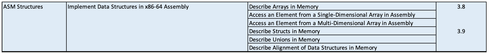

## Reading Track

This Lecture covers Chapters 3.8-3.9 (Assembly Expressions)

We’ll spend several classes on each of the Assembly Lectures.

Reading Homework:

1. Read through Chapter 3.10-3.11 (Stack and Buffer Overflows)
2. Continue to Review Chapters 3.1-3.9
    This semester we’ll be working with all of these topics in Assembly
   + Data Types and Sizes in x86-64 Assembly (Arrays of different types!)
   + Moving Data and Arithmetic
   + Control Flow (If/Else, Loops, and Switches)
   + Procedures (Callee-Save/Stack Save) with and without Recursion
   + One and Two dimensional Arrays, Structs, and Linked Lists

## Lecture Overview

{ width=100% }

## Array Allocation

The basic principle: `T A[N]` declares an array of data type `T` for integer constant `N` elements. The size of the array is `N * sizeof(T)` bytes.

{ width=75% }

### Question 1

The identifier A is the address of the first element of the array. This address can also be used as a pointer to the array element 0.

{ width=75% }

C Code | Type | Value |
:-: | :-: | :-: |
`A[4]` | `int` | `8` |
`A` | `int *` | `x` |
`A+1` | `int *` | `x+4` |
`&A[3]` | `int *` | `x+12` |
`*(A+3)` | `int` | `-3` |

## Array Allocation Example

Assume that we have the following arrays initialized:

```c
int gmu[5] = {1, 3, 5, 7, 9};
int mit[5] = {0, 1, 2, 1, 4};
int cmu[5] = {1, 2, 4, 1, 2};
```

Each array’s elements are contiguous in Memory. Each of the arrays may not be in successive 20-byte blocks!

{ width=65% }

## Accessing an Array Element

*File:* `array_access.s`

The starting address for an element in a array is `A + i * K` where `A` is the base address of the array, `i` is the index, and `K` is the data type size.

In Assembly, we need to use one of the forms ot access this element.

```asm
# %rdi = gmu
# %rsi = i
# Put the result in eax
movl (%rdi,%rsi,4), %eax  # gmu[i]
```

*File:* `array_loop_longs.c`

Let's write some assembly to sum up all the values of the array.

```c
long sum(int *ary, long len) {
  long ans = 0;
  for(long i = 0; i < len; i++) {
    ans += ary[i];
  }
  return ans;
}
int main() {
  int gmu[5] = {1,3,5,7,9};
  return sum(gmu, 5);
}
```

The corresponding assembly might look like

```asm
sum:                           #rdi has ary and rsi has number of elements in ary
  movq $0, %rcx               # long i = 0
  movq $0, %rax               # long ans = 0
  jmp test                    # Jump to Middle style For loop
top:
  addl (%rdi, %rcx, 4), %eax  # addl because ary is an int array
  incq %rcx                   # ++i;
test: 
  cmpq %rsi, %rcx             # compare i against len
  jl top
  ret                         # returns 64-bit ans in %rax
```

But what if we changed the return type of `sum` to `int`?

```c
long sum(int *ary,  int len) {
  int ans = 0;
  for(int i = 0; i < len; i++) {
    ans += ary[i];
  }
  return ans;
}
int main() {
  int gmu[5] = {1,3,5,7,9};
  return sum(gmu, 5);
}
```

We would need to modify our assembly:

```asm
sum:                          #rdi has ary and esi has number of elements in ary
  movl $0, %ecx               # int i = 0
  movl $0, %eax               # int ans = 0
  jmp test                    # Jump to Middle style For loop
top:
  movslq %ecx, %rcx           # Sign extend i to 64-bits for pointer math
  addl (%rdi, %rcx, 4), %eax  # addl because ary is an int array
  incl %ecx                   # ++i;
test:
  cmpl %esi,%ecx              #compare i against len
  jl top
  ret                         # returns 32-bit ans in %eax
```

## Digression -- Data Type Errors in Assembly

Consider

```asm
addl (%rdi, %ecx, 4), %eax # Bad Code
```

That would yield the following error message:

```text
array_loop_ints.s:23: Error: '(%rdi,%ecx,4)' is not a valid base/index expression
```

For dereferencing forms, this is address arithmetic, so it should be 64-bit register, like as follows:

```asm
addl (%rdi, %rcx, 4), %eax # Good Code
```

Again, if we used an incorrect suffix

```asm
incq %ecx # Bad Code
```

we would get the error message

```text
array_loop_ints.s:24: Error: incorrect register '%ecx' used with 'q' suffix
```

This is a 64-bit operation (incq) on a 32-bit register name (ecx). Types have to match!

```asm
incl %ecx # Good Code
```

## Nested Arrays

Nested arrays take the form of `T D[R][C]`. This form of a nested array has an array of `R` elements (rows),each of which has an entry of `C` elements (columns). In memory, the size of this array is `R * C * K` bytes, where `K` is the size of data type `T`.

As an example, `int A[10][5]` would take `10 * 5 * 4 = 200` bytes.

## Nested Array Example

```c
int ary[4][5] = {{1, 5, 2, 0, 6},
                 {1, 5, 2, 1, 3 },
                 {1, 5, 2, 1, 7 },
                 {1, 5, 2, 2, 1 }};
```

The array `ary` is an array of four elements, allocated contiguously. Each element of `ary` is an array of 5 `int`s, allocated contiguously.

Nested arrays are ordered in memory in Row-Major ordering. This is analogous to all elements of the zeroth row being followed by the elements of the first row, and so on.

## Row Vectors and Accessing Elements

Consider the following array:

![The array `int ary[4][5]`.](images/ArrayExample1.png){ width=100% }

To access the element `ary[i][j]`, we use the formula `A + (i * C * K) + (j * K)` where `A` is the base address, `i` is the $i$th row vector, `C` is the number of columns, `j` is the $j$th column vector, and `K` is the size of the data type.

We can use the simplified mathematical version

$$
A + (i \times C \times K) + (j \times K) \equiv A + (i \times C + j) \times K.
$$

To access some arbitrary element of the array `ary` where `%rdi` holds `i` and `%rsi` holds `j`, we would use the following assembly (remember that `ary` is a static defined region, so you can use it like an immediate address)

```asm
leaq (, %rsi, 4), %rdx        # K * j
leaq (%rdi, %rdi, 4), %rdi    # C * i
movl ary(%rdx, %rdi, 4), %eax #*(ary+i*C*K*+j*K)
```

(The second instruction sets `%rdi` to five times the previous value since `ary` is a $4 \times 5$ array.)

## Array Practice

### Question 3

Suppose we have the following arrays that we will store sequentially starting at memory address `0x100`.

```c
int   A[20];
char  B[40];
int   C[200];
```

For your convenience, the following conversions are provided.

Math Hints

+ `40 = 0x28`
+ `80 = 0x50`
+ `800 = 0x320`

Array | Bytes Needed | Base Address | Equation for `arr[i]` |
:-: | :-: | :-: | :-: |
`A[]` | `20 * 4 = 80 (0x50)` | `0x100` | `0x100 + i * 4` |
`B[]` | `40 * 1 = 40 (0x28)` | `0x150` | `0x150 + i * 1` |
`C[]` | `200 * 4 = 800 (0x320)` | `0x178` | `0x178 + i * 4` |

## Nested Array Practice

### Question 4

Suppose we have the following arrays that we will store sequentially starting at memory address `0x1000`.

```c
int   A[10][10];
char  B[40][5];
int   C[20][10];
```

For your convenience, the following conversions are provided.

Math Hints

+ `200 = 0xC8`
+ `400 = 0x190`
+ `800 = 0x320`
+ `1600 = 0x640`

Array | Bytes Needed | Base Address | Equation for `arr[i][j]` |
:-: | :-: | :-: | :-: |
`A[][]` | `10 * 10 * 4 = 400 (0x190)` | `0x1000` | `0x1000 + (i *10*4) + (j*4)` |
`B[][]` | `40 * 5 * 1 = 200 (0xC8)` | `0x1190` | `0x1190 + (i * 5 * 1) + (j * 1)` |
`C[][]` | `20 * 10 * 4 = 800 (0x320)`| `0x1258` | `0x1258 + (i * 10 * 4) + (j * 4)` |

## Multi-Level Arrays

A multi-level array is an array of pointers to other arrays.

For example, if we had the following arrays defined

```c
int gmu[5] = {9, 4, 7, 2, 0};
int mit[5] = {0, 2, 1, 3, 9};
int cmu[5] = {1, 5, 2, 1, 3};
int *univ[3] = {mit, cmu, gmu};
```

then in memory they might look like

{ width=65% }

## Accessing a Multi-Dimensional Array Element

Our goal is to retrieve `univ[i][j]` (as defined previously).

We start by acquiring the address of the array that `univ` is referencing. The address is retrieved by dereferencing `univ + 8 * i`.

Then, we must index into that retrieved array: `(univ + 8 * i) + 4 * j`.

With assembly (assuming `%rdi` holds $i$ and `%rsi` holds $j$)

```asm
leaq (, %rsi, 4), %rsi      # 4*j
addq univ(, %rdi, 8), %rsi  # M[univ+8*i]+4*j
movl (%rsi), %eax           # M[M[univ+8*i]+4*j]
```

## Fixed-Size Arrays

If the dimensions of the arrays are constant, you can optimize the code further by pre-computing the offsets.

As an example, suppose that we have a two-dimensional, $16 \times 16$ array, `int A[16][16]`. Then

$$
\begin{aligned}
  \texttt{int }x &= A[i][j] \\
        &= M[A + (i\times C \times K) + (j \times K)] \\
        &= M[A + 64i + 4j]
\end{aligned}
$$

Our assembly would change thusly:

```asm
# a in %rdi, i in %rsi, j in %rdx
salq $6, %rsi             # 64i
addq %rsi, %rdi           # a + 64i
movl (%rdi,%rdx,4), %eax  # M[a + 64i + 4j]
ret
```

## Structs

C `struct`s are product types which allow for a heterogenous collection of types. They are represented by a block of memory in which all fields appear in order of declaration. The compiler determines the over size.

For example, suppose that we have the following `struct`:

```c
struct rec {
  int a[4];
  long i;
  struct rec *next;
};
```

With C, our in memory representation of the struct might look like

{ width=50% }

With assembly, given that `%rdi` contains the address of an instance of the `struct`, our memory would look like

{ width=30% }

The offset of each structure member must be determined at compile time.

Assume that we want to get the address of `r->a[idx]` using assembly.

```asm
# r in %rdi, idx in %rsi
leal (%rdi,%rsi,4), %eax
ret
```

## Linked Lists

Assuming the same `struct` `rec`, how would we get `r->next->next->i`?

{ width=50% }

```asm
# r starts out with the value 0
# Hint: Start with r = r->next;
movq 24(%rdi), %rdi # r = r->next = 100
movq 24(%rdi), %rdi # r = r->next = 40
movq 16(%rdi), %rax # x = r->i = 150
```

## Struct Alignment

Systems may use alignment restrictions for efficiency. Alignment is making sure each data type is organized such that its address starts on a multiple of its own size.

For Example: an `int` is 4 bytes, so it starts on an address that is a multiple of 4 bytes, like `0x600400` or `0x0400698`.

For alignment, an Array should be aligned to the data type inside.

For alignment, a `struct` should be aligned to the biggest data type inside. On this system, we will only be looking at alignment for `structs`.

For the following two rules assume the following struct:

```c
struct S1 {
  char c;
  int i[2];
  double v;
} *p;
```

### Rule One

All data types in a `struct` must start on a multiple of that type size.

{ width=65% }

### Rule Two

The `struct` size must be a multiple of the largest type inside of it.

{ width=65% }

## Struct Optimal Ordering

To reduce wasted space, reorder the structs to put the largest types first.

Compare the result of the first struct

```c
struct S1 {
  char c;
  double v;
  char x;
} *p;
```

{ width=65% }

with that of the organized struct

```c
struct S1 {
  double v;
  char c;
  char x;
} *p;
```

{ width=65% }

## Array of Structs

Since each `struct` is aligned to some multiple of the largest data type arrays of `struct`s are easy to handle.

```c
struct S2 {
  double v;
  int i[2];
  char c;
} *p;
```

{ width=65% }

An array of such `struct` might look like

{ width=65% }

## Unions

C unions are data types to allocate memory for the largest defined element.

They essentially allow for reinterpretation of data.

A `struct` like

```c
struct S1 {
  char c;
  int i[2];
  double v;
} *p;
```

looks like

{ width=65% }

The union

```c
union U1 {
  char c;
  int i[2];
  double v;
} *p;
```

looks like

{ width=25% }

Note that the `union` only allocates memory equivalent to the size of the largest member.
